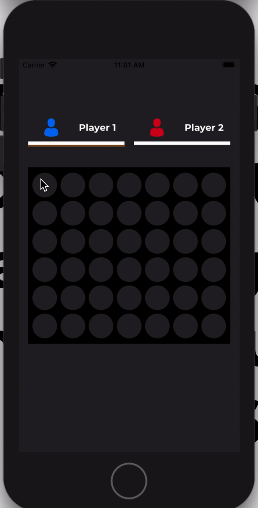

# Connect-4 - The old familiar connect 4 game - using VIPER
> Connect 4 is a two player game originally played on an actual board. The objective of the game is to be the first to form a horizontal, vertical or diagonal line of four of one's own discs. The game was made 100% using programmatic UI.

## Table of contents
* [General info](#general-info)
* [Screenshots](#screenshots)
* [Setup](#setup)
* [Technologies](#technologies)
* [Features](#features)
* [Status](#status)
* [Contact](#contact)

## General info
Connect-4 is a the old app from our childhood played on your phone for 2 players.

## Setup

1. Run app

## Screenshots

## Technologies
* Xcode 12.0
* Swift
* UIKit
* 100% Programmatic UI
* SnapKit
* VIPER

## Features
List of features ready and TODOs for future development
* Play the game for 2 human players
* Rematch

To-do list:
* Add a computer player using AI

## Status
Project is: _incomplete_

## Contact
Created by [@meitarbass] - feel free to contact me!
